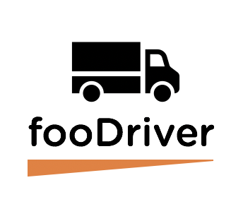

# fooDriver

fooDriver is a comprehensive digital pantry application for mobile grocery stores and food pantries serving the needs of people with low mobility or limited access to nutritious food. With fooDriver organizations administering mobile food pantries will have an overview of their fleet of mobile pantries, food items stored in the pantry, the drivers and the stops on the routes. Drivers or people working on the mobile pantry can keep track of inventory and restock items depending on the demand along the route. Organizations or individuals donating food items will be able to add to the inventory of the mobile pantries. With fooDriver we intend to streamline the operations of mobile grocery units and bring involved parties closer together in the process. Additionally, an administrative CLI is available for quick connect and data entry.

------
## Table of content

- [Application Architecture](#Application-Architecture)

- [Installation](#installation)
- [User Instructions](#User-Instructions)
- [Dependencies](#Dependencies)
- [License](#license)
- [Links](#links)
------

### Application Architecture
Node.js, Express, MongoDB

FooDriver is a digital pantry application that uses Javascript-related technologies and frameworks. It uses a MongoDB database to store (food) items, and uses Node.js and Express server architecture. The FooDriver application has a Command Line Interface(CLI) with which you can run commands to REGISTER an account and LOGIN as an *admin/ donator/ driver* and *user*. Moreover, you can add items to a digital pantry or take inventory by typing commands into the CLI. 

------

### Roles supported by the FooDriver application
- **Admin** will have full CRUD access and be able to view/review/approve/reject items submitted to the queue by submitter and update the pantry list with the items that have been previously approved and added to the data base.
- **Donator** will be able to view and submit-to-post items to the digital pantry.
- **Driver** will be able to take inventory(get) of the pantry, add (post) items to and remove(delete) from the pantry. The driver role could be the driver itself or somebody working on the mobile food pantry.
- **User** will be able to retrieve (get) information about a pantry and its driver. In addition *users* can post a request to the driver role to stock up on a particular item.

------
### Installing fooDriver
<!-- How to install the app  -->
- Clone the server
- Once cloned make sure Node.js is installed. 
- Navigate to the directory where you cloned the FooDriver repository and run the command `npm i` to install all the modules dependencies.
- Open your favorite IDE and create your .env file.
  - Add a PORT variable and set it to 3000 --> `PORT=3000`
  - Add a MONGODB_TEST_URI variable and set it to wherever you have a mongodb database instance --> `MONGODB_TEST_URI=mongodb://localhost:27017/database`
  - Add a SECRET variable to store your server password e.g. --> `SECRET=lawdylawd`
- Go to yet another terminal and run `node index.js` to connect to the web and database servers.
- You can now begin using the app

------
### Getting Started with fooDriver CLI
- Clone the CLI repo
- Once cloned `cd` into `src/lib` of the CLI repo.
- Then enter the following in your terminal: `node commands.js --help`. This will give you a list of commands.
- `node commands.js signup` will sign you up for the fooDriver server.
- `node commands.js get-driver` gets all the drivers.
- `node commands.js add-food` adds your food items to the pantry.
- `node commands.js get-food` gets the food items available in the pantry

------
### Dependencies

babel-env, babel-core, babel-eslint,babel-jest,babel-polyfill,babel-register, bcrypt, dotenv, eslint, express, jest, jsonwebtoken, mongoose, mongoose-autopopulate, mongodb-memory-server, supertest

------
### License
MIT License

